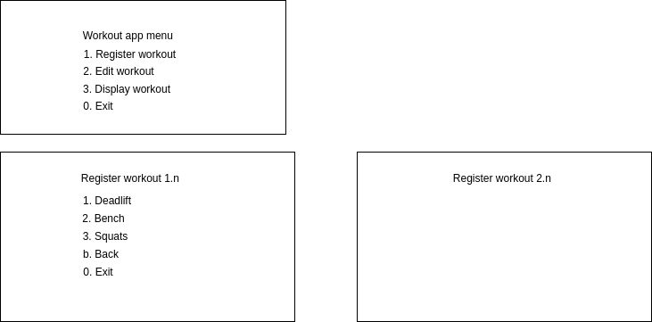

# How do I want to interact with the program?

## Context and Problem Statement

- How should the user interact with the program?
- Add a workout, edit a workout, display a workout, see progress over time  

## Considered options

### Terminal Menu App

Creating a menu where the user is asked about whether they want to add, edit or display a workout session

- con: might be a lot of writing on the developer end
- con: it's hard to design uis, even text ones
- con: I really hate drawing things out
- pro: good way to get the right information at the right time, more user friendly than parsing files.

### Terminal CLI App

Creating a CLI application where the user gets information about commands, and can execute them individually with various options.

- con: not so user friendly
- pro: developer/scripter friendly
- pro: reasonably simple to implement
- pro: no drawing involved in the design
- con: might be difficult to design good command hierarchies and options
- con: hard to distribute to non-technical users

[Terminal CLI App Design](./0002-user-interaction.terminal-cli.md)

### Web App

Use web technologies to make the app.

- con: I have no idea how to do this at the moment
- pro: easy to distribute to non-technical users

## Decision outcome

use the:

